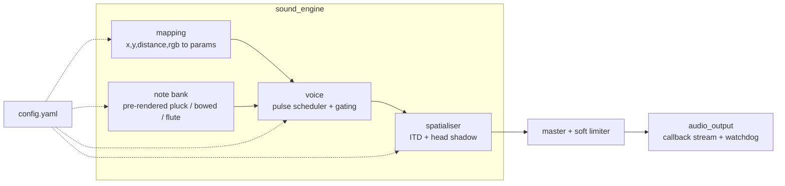

# Naadrik

*Naad* (sound) + *Drik* (seer): the one who sees through sound.

Naadrik is an offline assistive app that lets blind and visually impaired people perceive the
objects around them (their position, distance and colour) through sound. A camera feeds an
on-device detector; each important object becomes **one sound** that encodes everything about it.
Nothing leaves the device.

## How it sounds

| Property | Sound |
|---|---|
| Left / right | 3D position on headphones (interaural time and level differences with a spherical-head model) |
| Height | Pitch on a pentatonic scale over 2.5 octaves: higher in the frame means higher pitch |
| Distance | Pulse rate: close = fast (8 Hz), far = slow (1 Hz). Volume never encodes distance |
| Colour | Red = plucked string (sitar-like), green = bowed string (violin-like), blue = flute. Each channel is quantised to off / low / high |
| Brightness | Overall loudness: black is silent, white is all three instruments loud |

At most three objects sound at once. Every parameter lives in [`config.yaml`](config.yaml).
The reasoning behind each choice is in [`docs/sound-mapping.md`](docs/sound-mapping.md).

## Status

| Version | Milestone | State |
|---|---|---|
| v0.1.0 | Sound engine | done |
| v0.2.0 | Live camera pipeline | planned |
| v0.3.0 | Training mode | planned |
| v0.4.0 | Study / evaluation mode | planned |
| v1.0.0 | Android app | planned |

## Setup

Requires Python 3.11+ and PortAudio (`sudo dnf install portaudio` or `sudo apt install libportaudio2`).

```bash
python3 -m venv .venv
source .venv/bin/activate
pip install -e ".[dev]"
```

## Running

Listen to the mapping with example objects (use headphones; position needs both ears):

```bash
naadrik demo --list                  # list scenarios
naadrik demo                         # play them all
naadrik demo red-high-left-close approach
naadrik demo --no-play --save-dir output/demo   # write WAV files instead
naadrik devices                      # list audio outputs
naadrik --device 0 demo              # play on a specific output
```

Edit `config.yaml` and rerun the demo to tune pitch range, pulse rates, colour thresholds,
instrument timbres or spatialisation. Use `--config PATH` or `NAADRIK_CONFIG` for another file.

From Python:

```python
from naadrik.config import load_config
from naadrik.sound_engine import SoundEngine

engine = SoundEngine(load_config())
stereo = engine.render_object(x=0.1, y=0.2, distance=0.0, r=1.0, g=0.0, b=0.0)  # (frames, 2) float32
```

`x`, `y` are normalised image coordinates (origin top-left), `distance` runs from 0 (near) to
1 (far), and colour channels are in [0, 1].

### Audio troubleshooting

* **Bluetooth headsets in hands-free (HFP/HSP) mode** are mono at 16 kHz: position cues are lost
  and some PipeWire setups stall the stream. Switch the headset to its stereo (A2DP) profile, or
  use wired headphones. Naadrik reports a stalled device instead of hanging.
* If the default output misbehaves, pick a device from `naadrik devices` with `--device`.

## Architecture



Pitch is quantised to a scale, so every note is rendered once at start-up and the real-time
path only slices, gates, mixes and filters arrays: three voices take about 0.26 ms per 5.3 ms
audio block. Camera capture, detection, depth and prioritisation modules arrive in v0.2.0.

## Development

```bash
pytest          # tests
ruff check .    # lint
black .         # format
```

See [`CONTRIBUTING.md`](CONTRIBUTING.md), [`docs/decisions.md`](docs/decisions.md) and
[`CHANGELOG.md`](CHANGELOG.md).

## Licence

Apache License 2.0. See [`LICENSE`](LICENSE).
