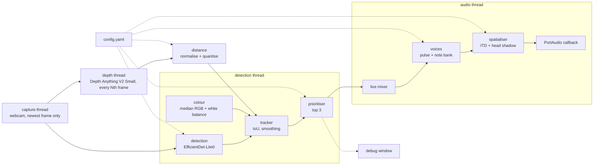

# Naadrik

*Naad* (sound) + *Drik* (seer): the one who sees through sound.

Naadrik is an offline assistive app that lets blind and visually impaired people perceive the
objects around them (their position, distance and colour) through sound. A camera feeds an
on-device detector; each important object becomes **one sound** that encodes everything about it.
Nothing leaves the device.

## How it sounds

| Property | Sound |
|---|---|
| Left / right | 3D position on headphones (interaural time and level differences with a spherical-head model) |
| Height | Pitch on a pentatonic scale over 2.5 octaves: higher in the frame means higher pitch |
| Distance | Pulse rate: close = fast (8 Hz), far = slow (1 Hz). Volume never encodes distance |
| Colour | Red = plucked string (sitar-like), green = bowed string (violin-like), blue = flute. Each channel is quantised to off / low / high |
| Brightness | Overall loudness: black is silent, white is all three instruments loud |

At most three objects sound at once. Every parameter lives in [`config.yaml`](config.yaml).
The reasoning behind each choice is in [`docs/sound-mapping.md`](docs/sound-mapping.md).

## Status

| Version | Milestone | State |
|---|---|---|
| v0.1.0 | Sound engine | done |
| v0.2.0 | Live camera pipeline | done |
| v0.3.0 | Training mode | done |
| v0.4.0 | Study / evaluation mode | done |
| v1.0.0 | Android app | planned |

## Setup

Requires Python 3.11+, PortAudio (`sudo dnf install portaudio` or `sudo apt install libportaudio2`),
eSpeak NG for training mode, a webcam for live mode, and headphones.

```bash
python3 -m venv .venv
source .venv/bin/activate
pip install -e ".[dev]"
naadrik models download     # one-time, ~113 MB; everything runs offline afterwards
```

| Model | Use | Licence |
|---|---|---|
| EfficientDet-Lite0 (MediaPipe Tasks, COCO, 80 classes) | object detection | Apache-2.0 |
| Depth Anything V2 Small (ONNX Runtime, CPU) | relative depth | Apache-2.0 |

`naadrik models` shows whether they are present and match the expected checksums.

## Running

Listen to the mapping with example objects (use headphones; position needs both ears):

```bash
naadrik demo --list                  # list scenarios
naadrik demo                         # play them all
naadrik demo red-high-left-close approach
naadrik demo --no-play --save-dir output/demo   # write WAV files instead
naadrik devices                      # list audio outputs
naadrik --device 0 demo              # play on a specific output
```

### Live mode

```bash
naadrik live                         # webcam + debug window; q quits, d toggles depth view, m mutes
naadrik live --no-window             # headless
naadrik live --camera 1 --duration 60 --save-debug output/debug.png
naadrik calibrate                    # optional: record near/far depth references
```

The debug window shows each tracked object's box, label, distance and sampled colour, and for
the (up to three) sounding objects their pitch, azimuth, pulse rate and instrument levels, plus
live latency figures. Latency is also logged every five seconds.

Distance comes from a relative depth model, so by default it is judged against the rest of the
scene (`depth.normalisation: scene`). For distances that are stable across scenes, run
`naadrik calibrate` and set `depth.normalisation: calibrated`.

### Training mode

Training mode speaks a short label before each object's sound ("red cup, left, near"), from the
object's direction, so the mapping can be learned by ear. Other sounds duck while it speaks.

```bash
naadrik train                        # live camera with spoken labels
naadrik train --no-camera            # practise with synthetic objects, no camera needed
naadrik train --no-camera --trials 20
naadrik train --always-speak         # ignore the fade-out
naadrik train --reset-progress       # start again from session 1
```

Sessions are counted in `~/.local/share/naadrik/training.yaml`. Every object is announced in the
first `full_speech_sessions` (3), then the chance of an announcement falls linearly to zero over
`fade_sessions` (5), so by session 9 the user relies on the sounds alone. An object still sounding
is announced again every `repeat_s` (20 s). Speech uses eSpeak NG offline
(`sudo dnf install espeak-ng` or `sudo apt install espeak-ng`).

### Study mode

A controlled comparison of Naadrik against a classic vOICe-style mapping, with synthetic
stimuli (no camera), three phases (baseline, training with feedback, test) and CSV output:

```bash
naadrik study --participant P01                  # both conditions
naadrik study --participant P02 --order voice-first
naadrik analyse                                  # report.md + charts in results/report/
```

See [`docs/study.md`](docs/study.md) for the protocol, file formats and analysis.

### Tuning

Edit `config.yaml` and rerun the demo to tune pitch range, pulse rates, colour thresholds,
instrument timbres or spatialisation. Use `--config PATH` or `NAADRIK_CONFIG` for another file.

From Python:

```python
from naadrik.config import load_config
from naadrik.sound_engine import SoundEngine

engine = SoundEngine(load_config())
stereo = engine.render_object(x=0.1, y=0.2, distance=0.0, r=1.0, g=0.0, b=0.0)  # (frames, 2) float32
```

`x`, `y` are normalised image coordinates (origin top-left), `distance` runs from 0 (near) to
1 (far), and colour channels are in [0, 1].

### Audio troubleshooting

* **Bluetooth headsets in hands-free (HFP/HSP) mode** are mono at 16 kHz: position cues are lost
  and some PipeWire setups stall the stream. Switch the headset to its stereo (A2DP) profile, or
  use wired headphones. Naadrik reports a stalled device instead of hanging.
* If the default output misbehaves, pick a device from `naadrik devices` with `--device`.

## Architecture



| Module | Role |
|---|---|
| `capture` | Webcam on its own thread; keeps only the newest frame so delays never accumulate |
| `detection` | MediaPipe object detector; boxes normalised to [0, 1] |
| `depth` / `distance` | Relative depth every Nth frame; median disparity in each box → near / mid / far with hysteresis |
| `colour` | Median RGB of the box centre after grey-world white balance and exposure normalisation |
| `tracker` | IoU association per label; smoothed position, velocity, distance, approach rate and colour |
| `prioritiser` | closeness × class importance × centredness, boosted for motion; sticky top-3 |
| `sound_engine` | Mappings, synthesised instruments, pulsed voices, live mixer |
| `spatialiser` | Binaural rendering per voice |
| `audio_output` | Low-latency callback stream with a stall watchdog |
| `pipeline` / `live` | Threads and wiring; latency measurement |
| `training` | Spoken descriptions, session progress and fade-out, announcement coach |
| `speech` | Offline text-to-speech via eSpeak NG |
| `stimuli` | Synthetic 3×3×3 grid stimuli shared by training and the study |
| `study` | Baseline sonifier, three-phase protocol, CSV records, analysis and charts |
| `ui` | Debug view |

Pitch is quantised to a scale, so every note is rendered once at start-up and the audio thread
only slices, gates, mixes and filters arrays (≈0.26 ms per 5.3 ms block for three voices).
Measured latency is in [`docs/latency.md`](docs/latency.md).

## Development

```bash
pytest          # tests
ruff check .    # lint
black .         # format
```

See [`CONTRIBUTING.md`](CONTRIBUTING.md), [`docs/decisions.md`](docs/decisions.md) and
[`CHANGELOG.md`](CHANGELOG.md).

## Licence

Apache License 2.0. See [`LICENSE`](LICENSE).
